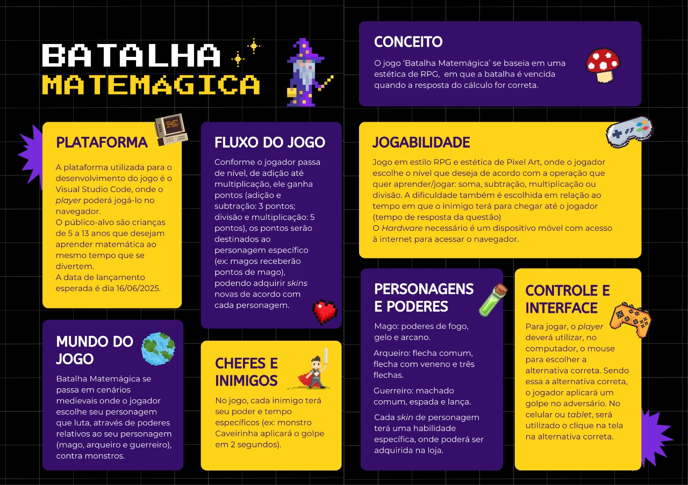

<h1>Matemagica</h1>

<h4>O jogo Batalha Matemágica é um RPG educativo com estética em Pixel Art, voltado para crianças de 5 a 13 anos. O objetivo é ensinar matemática (soma, subtração, multiplicação e divisão) de forma divertida, vencendo batalhas ao acertar cálculos.</h4>

